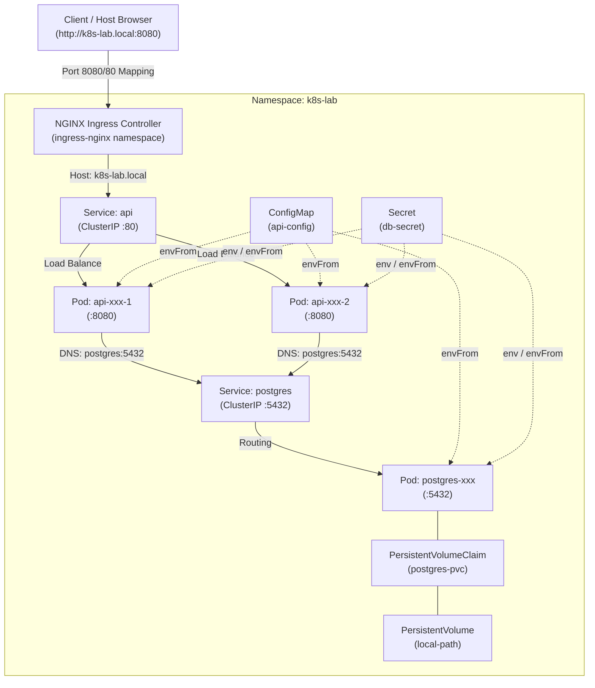

# Kubernetes Deployment Lab — Phase 1

A hands-on, minimal full-stack deployment on a local [Kind](https://kind.sigs.k8s.io/) (Kubernetes in Docker) cluster. This lab demonstrates core Kubernetes fundamentals end-to-end:

$$\text{Ingress} \longrightarrow \text{API Service} \longrightarrow \text{API Pods} \longrightarrow \text{PostgreSQL Service} \longrightarrow \text{PostgreSQL Pod} \longrightarrow \text{PersistentVolumeClaim}$$

---

## 📑 Core Concepts Covered

* **Namespaces**: Logical isolation of lab resources (`k8s-lab`).
* **Deployments & ReplicaSets**: Declarative workload management and self-healing.
* **Services (ClusterIP)**: Stable internal DNS names and load-balanced pod endpoints.
* **Ingress (NGINX)**: Layer 7 host-based routing (`k8s-lab.local`).
* **ConfigMaps & Secrets**: Decoupling configuration and credentials from container images.
* **PersistentVolumeClaims & PVs**: Stateful data persistence via Kind's default `local-path-provisioner`.

---

## 🏗️ Architecture



---

## 📂 Project Structure

```
.
├── app/
│   ├── Dockerfile             # Multi-stage build (golang:1.22 -> alpine:3.19)
│   ├── go.mod                 # Go module definition
│   └── main.go                # REST API with /health and /items endpoints
├── k8s/
│   ├── namespace.yaml         # k8s-lab namespace definition
│   ├── configmap.yaml         # Non-sensitive configuration (ports, db names)
│   ├── secret.yaml            # Database credentials and connection string
│   ├── postgres-pvc.yaml      # PersistentVolumeClaim for PostgreSQL storage
│   ├── postgres-deployment.yaml # PostgreSQL single-replica deployment
│   ├── postgres-service.yaml  # ClusterIP service for internal DB discovery
│   ├── api-deployment.yaml    # Go API deployment (2 replicas)
│   ├── api-service.yaml       # ClusterIP service for Go API
│   └── ingress.yaml           # NGINX Ingress rules for k8s-lab.local
├── kind-config.yaml           # Kind cluster config with ingress port mappings
└── README.md
```

---

## 🛠️ Prerequisites

Make sure the following tools are installed:
* [Docker Desktop / Engine](https://docs.docker.com/get-docker/)
* [kubectl](https://kubernetes.io/docs/tasks/tools/#kubectl)
* [kind](https://kind.sigs.k8s.io/docs/user/quick-start/#installation)

Verify installations:
```bash
docker --version
kubectl version --client
kind --version
```

---

## 🚀 Quickstart & Setup Guide

### Option A: One-Click Automated Setup (Recommended)

Run the automated PowerShell script to spin up the cluster, load images, and deploy everything:

```powershell
.\setup.ps1
```

To delete the cluster:
```powershell
.\teardown.ps1
```

---

### Option B: Manual Step-by-Step Setup

### Step 1: Create the Kind Cluster

Create the cluster using the configuration with ingress-ready node labels and port mappings:

```bash
kind create cluster --name k8s-lab --config kind-config.yaml
kubectl cluster-info --context kind-k8s-lab
```

### Step 2: Build and Load the Application Image

Build the Go API image locally, then load it directly into the Kind cluster's internal containerd cache:

```bash
# Build the Docker image
cd app
docker build -t k8s-lab-api:v1 .
cd ..

# Load the image into the Kind cluster
kind load docker-image k8s-lab-api:v1 --name k8s-lab
```

### Step 3: Install NGINX Ingress Controller

Deploy the official Kind-tailored NGINX Ingress controller manifest:

```bash
kubectl apply -f https://raw.githubusercontent.com/kubernetes/ingress-nginx/main/deploy/static/provider/kind/deploy.yaml

# Wait until the ingress controller is ready (timeout ~120s)
kubectl wait --namespace ingress-nginx \
  --for=condition=ready pod \
  --selector=app.kubernetes.io/component=controller \
  --timeout=120s
```

### Step 4: Deploy Kubernetes Manifests

Apply the resources in dependency order:

```bash
# 1. Namespace, Config, and Secret
kubectl apply -f k8s/namespace.yaml
kubectl apply -f k8s/configmap.yaml
kubectl apply -f k8s/secret.yaml

# 2. Database Storage, Deployment, and Service
kubectl apply -f k8s/postgres-pvc.yaml
kubectl apply -f k8s/postgres-deployment.yaml
kubectl apply -f k8s/postgres-service.yaml
kubectl rollout status deployment/postgres -n k8s-lab

# 3. API Deployment, Service, and Ingress
kubectl apply -f k8s/api-deployment.yaml
kubectl apply -f k8s/api-service.yaml
kubectl rollout status deployment/api -n k8s-lab
kubectl apply -f k8s/ingress.yaml
```

### Step 5: Configure Local DNS

Map `k8s-lab.local` to `127.0.0.1` in your operating system's hosts file:

* **Windows** (Run in PowerShell as Administrator):
  ```powershell
  Add-Content -Path C:\Windows\System32\drivers\etc\hosts -Value "`n127.0.0.1 k8s-lab.local"
  ```
* **macOS / Linux**:
  ```bash
  echo "127.0.0.1 k8s-lab.local" | sudo tee -a /etc/hosts
  ```

---

## 🧪 Testing & Verification

> **Note on Ports**: Depending on whether your Kind cluster maps to host port `80` or `8080`, use the corresponding port in your requests.

### 1. Health Check (`GET /health`)
Verifies API availability and active PostgreSQL connectivity:
```bash
curl http://k8s-lab.local:8080/health
```
```json
{"status":"ok"}
```

### 2. Create an Item (`POST /items`)
Insert a new record into PostgreSQL:
* **PowerShell**:
  ```powershell
  Invoke-RestMethod -Uri "http://k8s-lab.local:8080/items" -Method Post -ContentType "application/json" -Body '{"name":"first item"}'
  ```
* **cURL**:
  ```bash
  curl -X POST http://k8s-lab.local:8080/items \
    -H "Content-Type: application/json" \
    -d '{"name":"first item"}'
  ```
```json
{"id":1,"name":"first item"}
```

### 3. List All Items (`GET /items`)
Retrieve all persisted records:
```bash
curl http://k8s-lab.local:8080/items
```
```json
[{"id":1,"name":"first item"}]
```

---

## 🔬 Self-Healing & Scaling Experiments

### Test Self-Healing (Pod Recreation)
Delete an API pod and observe how the ReplicaSet automatically creates a new one to satisfy `replicas: 2`:
```bash
kubectl get pods -n k8s-lab -l app=api
kubectl delete pod -n k8s-lab -l app=api --dry-run=client -o name | head -n 1 | xargs kubectl delete -n k8s-lab
kubectl get pods -n k8s-lab -l app=api -w
```

### Test Scaling
Scale the API deployment up to 4 replicas and verify the Service endpoints automatically update:
```bash
kubectl scale deployment/api --replicas=4 -n k8s-lab
kubectl get pods -n k8s-lab -l app=api
kubectl get endpoints api -n k8s-lab
```

---

## 🔍 Troubleshooting

| Symptom | Cause | Solution |
| :--- | :--- | :--- |
| **`ImagePullBackOff` on `api` pod** | The container image is not present in Kind's internal containerd cache. | Run `kind load docker-image k8s-lab-api:v1 --name k8s-lab`. |
| **`{"status":"db unreachable"}`** | API cannot connect to PostgreSQL. | Check DB pod logs (`kubectl logs -n k8s-lab deployment/postgres`) and ensure service `postgres` is healthy. |
| **`404 Not Found (Microsoft-IIS)`** | Windows IIS or another service is listening on port `80`. | Send traffic through port `:8080` (e.g. `http://k8s-lab.local:8080`). |
| **Could not resolve host `k8s-lab.local`** | Missing hosts file entry. | Add `127.0.0.1 k8s-lab.local` to `hosts`. |

---

## 🧹 Teardown

Delete the local Kind cluster when finished:

```bash
kind delete cluster --name k8s-lab
```
